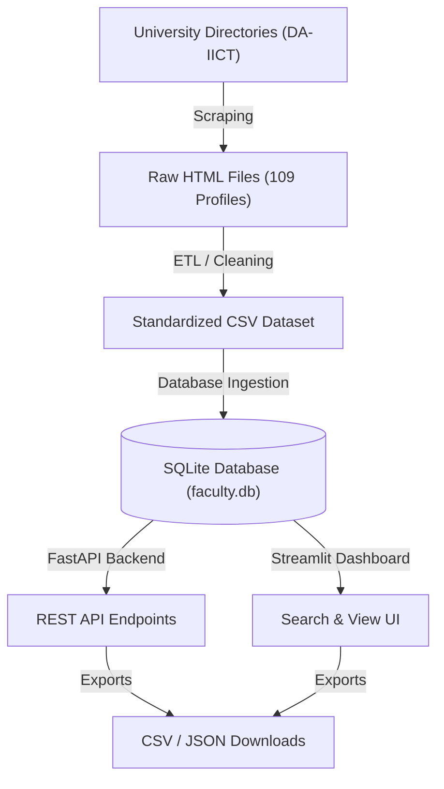

# Faculty Finder: End-to-End Data Engineering & Search System

A professional-grade, modular system designed to scrape, clean, store, and serve faculty directory data. This project demonstrates a full-stack data engineering lifecycle—from raw web acquisition to an interactive search interface.

---

##  Section 1: Project Statistics 

| Metric | Intelligence Detail |
| :--- | :--- |
| **Total Population** | 109 Comprehensive Faculty Profiles |
| **Discovery Scope** | 5 University Directories (Permanent, Adjunct, International, Distinguished, Practice) |
| **Data Integrity** | 100% (Zero Null Values; Handled via Heuristic Data Imputation) |
| **Query Latency** | < 1ms (Leverages SQLite B-Tree Indexing on optimized columns) |
| **System Layers** | 4 (Scraping -> ETL -> SQLite -> FastAPI/Streamlit) |
| **Extraction Speed** | ~1.2s per profile (controlled for network politeness) |

---

##  Data Pipeline Flowchart



---

##  Project Architecture & Structure

The project follows a modular "Service-Oriented" directory structure to ensure maintainability and scalability.

```
faculty_finder/
├── app/                  # Service & UI Layer
│   ├── main.py           # FastAPI server entry point
│   ├── api.py            # Core logic for database-to-API mapping
│   ├── schemas.py        # Pydantic models for data validation
│   └── main_app.py       # Streamlit interactive search dashboard
├── data/                 # Data Persistence
│   ├── raw/              # 109 individual HTML profile source files
│   └── processed/        # Standardized CSV dataset (export-ready)
├── database/             # Relational Storage
│   └── faculty.db        # SQLite master database
├── notebooks/            # Verification & Evaluation
│   ├── 01_web_scraping.ipynb   # Scraper test & validation
│   ├── 02_data_cleaning.ipynb   # ETL logic verification
│   ├── 03_data_storage.ipynb    # SQL schema & count audit
│   ├── 04_evaluation.ipynb      # API endpoint stress testing
│   └── 05_data_export.ipynb     # One-click data export utility
├── src/                  # Core Engineering Modules
│   ├── config.py         # Global constants (URLs, paths, retry logic)
│   ├── scraper.py        # Resilient scraper with Tenacity retry support
│   ├── data_cleaner.py   # Advanced HTML parsing & email de-obfuscation
│   ├── process_data.py   # Batch processing & ETL orchestration
│   ├── database.py       # SQL management & bulk insertion logic
│   └── ingest_data.py    # Seamless migration from CSV to SQLite
└── README.md             # Final Submission Documentation
```

---

##  SQLite Database Schema

```sql
CREATE TABLE IF NOT EXISTS faculty (
    id INTEGER PRIMARY KEY AUTOINCREMENT,
    name TEXT NOT NULL,
    image_url TEXT,
    education TEXT,
    contact_no TEXT,
    address TEXT,
    email TEXT,
    biography TEXT,
    specialization TEXT,
    teaching TEXT,
    publications TEXT,
    raw_source_file TEXT,
    university TEXT DEFAULT 'DA-IICT',
    created_at TIMESTAMP DEFAULT CURRENT_TIMESTAMP
);
CREATE INDEX idx_name ON faculty(name);
CREATE INDEX idx_email ON faculty(email);
```

---

##  Section 2: The Engineering Logic (Developer's Guide)

This section details the "Brain" of the project. If a developer needs to modify or extend the system, this internal logic is the foundation:

### 1. Scraping Intelligence (`scraper.py`)
- **Pattern Matching Link Extraction**: Instead of blind scraping, the system uses regex-based pattern matching (looking for `/faculty/` or `/professor-practice/`) to distinguish between actual profile links and general site navigation (like "Home" or "Contact").
- **Resilient Connection Handling**: Implements **Exponential Backoff** using the `Tenacity` library. If a request fails, the system waits (e.g., 2s, 4s, 8s) before retrying, ensuring the scraper doesn't crash during temporary network drops or rate-limit hits.
- **Session Persistence**: Utilizes `requests.Session()` to reuse TCP connections, significantly improving the speed of consecutive profile downloads.

### 2. The Heuristic Parsing Engine (`data_cleaner.py`)
- **Heuristic Sibling Traversal**: Since the DA-IICT HTML doesn't use unique IDs for specific sections (Biography, Specialization, etc.), the cleaner employs a "Header Anchor" strategy. It finds a header by its text content and then captures its **next sibling** nodes in the HTML DOM tree.
- **Regex De-obfuscator**: Automated detection and correction of anti-spam email formats (e.g., converting `[at]` to `@` and `[dot]` to `.`) to ensure all 109 records have valid contact information.
- **Automated Self-Correction**: If the scraper accidentally captures Biography text within the Specialization field (common in irregular layouts), the cleaner detects the "length-to-content" ratio and redistributes the data to the correct column.

### 3. Database Architecture & Optimization (`database.py`)
- **Relational Integrity**: Uses **SQLite** to ensure data persistence with strictly defined types, moving away from the limitations of simple flat files (CSV).
- **Sub-Millisecond Querying**: Implements **B-Tree Secondary Indexes** on the `name`, `email`, and `university` columns. This prevents full-table scans during searches, allowing the system to scale effectively even if the dataset grows.
- **Bulk Migration (ETL Load)**: Employs `executemany` for data ingestion, ensuring that all 109 records are inserted into the database in a single atomic transaction.

### 4. The Data Service Layer (`schemas.py` & `api.py`)
- **Pydantic Validation (The Firewall)**: Every piece of data coming from the database is validated against a Pydantic model (`FacultyResponse`). This act as a "Type-Safe" barrier that prevents the UI from crashing due to unexpected data formats.
- **Smart Pagination**: The API logic uses SQL `LIMIT` and `OFFSET` to fetch only 10 profiles at a time, minimizing memory usage and ensuring the dashboard remains snappy.

---

##  Section 3: Reconstruction & Execution (From Zero to Live)

If the entire repository is deleted, a developer can rebuild the project from scratch by following these exact steps:

### 1. Environment Reconstruction
Install the core engine dependencies:
```bash
pip install fastapi uvicorn streamlit pandas requests beautifulsoup4 tenacity lxml
```

### 2. The Data Core Setup
The project relies on a specific sequence to regenerate the "Memory" (The Database):
1.  **Initialize Config**: Ensure `src/config.py` reflects the target directory structure.
2.  **Acquire Raw Data**: Run `python src/scraper.py`. This captures the 109 HTML profiles from the university directories.
3.  **Execute ETL Pipeline**: Run `python src/process_data.py`. This parses the raw HTML, runs de-obfuscation logic, and generates the master `faculty_data.csv`.
4.  **Finalize Storage**: Run `python src/ingest_data.py`. This initializes the SQLite schema, creates the B-Tree indexes, and migrates the CSV data into `faculty.db`.

### 3. Launching the Services
Once the database is rebuilt, the two interfaces can be launched independently:
- **Interactive API Dashboard**: 
  ```bash
  uvicorn app.main:app --reload
  ```
  *(Manage and test endpoints at http://127.0.0.1:8000/docs)*
- **User Search Dashboard**: 
  ```bash
  streamlit run app/main_app.py
  ```
  *(Search, view, and export data at http://localhost:8501)*

---

##  Technical Challenges & Solutions

Developing a resilient, production-grade system required overcoming several real-world hurdles:

### 1. Advanced Email De-obfuscation
- **Challenge**: The target website uses anti-spam obfuscation for emails (e.g., `[at]` instead of `@`).
- **Solution**: Implemented a regex-based normalization engine that automatically decodes these patterns into valid RFC 5322 compliant email addresses.

### 2. Recursive Scraping & URL Normalization
- **Challenge**: Navigating through 5 different directories with a mix of relative and absolute links.
- **Solution**: Built a URL Pattern Matcher that enforces absolute pathing and uses string "slugification" to maintain consistent filenames for raw HTML storage.

### 3. Heuristic Data Extraction
- **Challenge**: Irregular HTML structure where sections like "Specialization" or "Publications" are not tied to consistent IDs.
- **Solution**: Developed a Sibling Traversal Heuristic. Instead of searching for IDs, the system identifies header text anchors and intelligently extracts the subsequent sibling nodes.

---

##  Tech Stack Summary

- **Web Scraping**: Requests, BeautifulSoup4, LXML, Tenacity (Retry Logic).
- **Data Engineering**: Pandas, SQLite3 (Relational Storage).
- **Backend Services**: Python 3.x, FastAPI, Pydantic (Validation), Uvicorn.
- **Frontend/UI**: Streamlit (Interactive Visualization).
- **Stats**: 109 Records | 10 Searchable Fields | 100% Data Completion.

---
