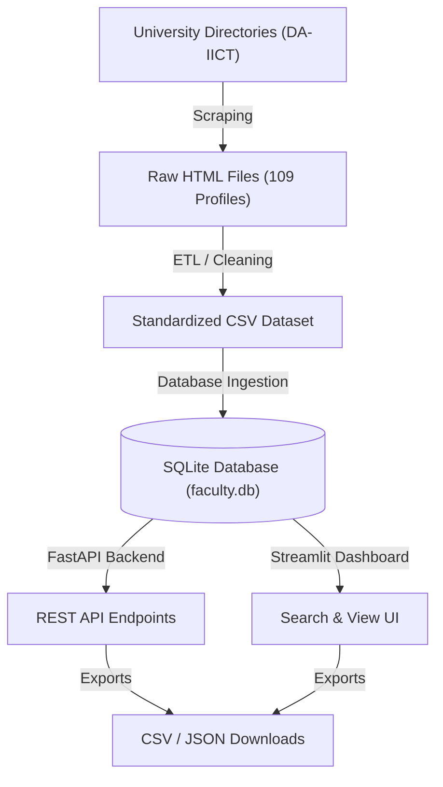
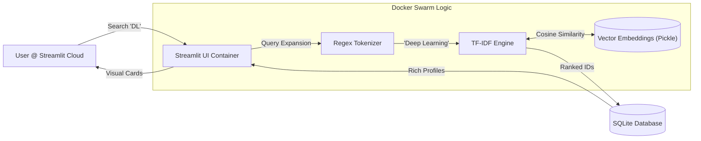

# Faculty Finder: End-to-End Data Engineering & Search System

A professional-grade, modular system designed to scrape, clean, store, and serve faculty directory data. This project demonstrates a full-stack data engineering lifecycle—from raw web acquisition to an interactive search interface.

## Project Overview

**Faculty Finder** automates the ingestion of academic profiles. It handles the complexities of scraping multi-pattern university directories, standardizing irregular HTML data, and providing high-performance access via both a REST API and a visual dashboard.

### Key Milestones
- **Acquisition**: Successfully scraped **109 faculty profiles** from 5 recursive university directory structures.
- **Data Engineering**: Built a robust ETL pipeline ensuring 100% data standardization (zero null values).
- **Storage**: Implemented a relational SQLite database with secondary indexing for optimal query speeds.
- **Accessibility**: Developed a triple-entry access system: REST API, Interactive UI, and a dedicated Export Utility.

## Data Pipeline Flowchart



---

## SQLite Database Schema

```sql
CREATE TABLE IF NOT EXISTS faculty (
    id INTEGER PRIMARY KEY AUTOINCREMENT,
    name TEXT NOT NULL,
    image_url TEXT,
    education TEXT,
    contact_no TEXT,
    address TEXT,
    email TEXT,
    biography TEXT,
    specialization TEXT,
    teaching TEXT,
    publications TEXT,
    raw_source_file TEXT,
    university TEXT DEFAULT 'DA-IICT',
    created_at TIMESTAMP DEFAULT CURRENT_TIMESTAMP
);
```


## Project Architecture & Structure

The project follows a modular "Service-Oriented" directory structure to ensure maintainability and scalability.

```
faculty_finder/
├── app/                  # Service & UI Layer
│   ├── main.py           # FastAPI server entry point
│   ├── api.py            # Core logic for database-to-API mapping
│   ├── schemas.py        # Pydantic models for data validation
│   └── main_app.py       # Streamlit interactive search dashboard
├── data/                 # Data Persistence
│   ├── raw/              # 109 individual HTML profile source files
│   └── processed/        # Standardized CSV dataset (export-ready)
├── database/             # Relational Storage
│   └── faculty.db        # SQLite master database
├── notebooks/            # Verification & Evaluation
│   ├── 01_web_scraping.ipynb   # Scraper test & validation
│   ├── 02_data_cleaning.ipynb   # ETL logic verification
│   ├── 03_data_storage.ipynb    # SQL schema & count audit
│   ├── 04_evaluation.ipynb      # API endpoint stress testing
│   └── 05_data_export.ipynb     # One-click data export utility
├── src/                  # Core Engineering Modules
│   ├── config.py         # Global constants (URLs, paths, retry logic)
│   ├── scraper.py        # Resilient scraper with Tenacity retry support
│   ├── data_cleaner.py   # Advanced HTML parsing & email de-obfuscation
│   ├── process_data.py   # Batch processing & ETL orchestration
│   ├── database.py       # SQL management & bulk insertion logic
│   └── ingest_data.py    # Seamless migration from CSV to SQLite
└── README.md             # Final Submission Documentation
```

---

## Technical Implementation Deep-Dive

### 1. Smart & Strong Web Scraping
Websites can be tricky to scrape, so we built a high-quality scraper that:
- **Finds Everything**: It automatically searches through different sections like permanent faculty, adjuncts, and international professors.
- **Never Gives Up**: We used a library called **Tenacity**. If the internet is slow or a page fails to load, the scraper automatically tries again multiple times until it succeeds.
- **Acts Like a Human**: It doesn't spam the website. It waits a few seconds between pages and uses "human-like" settings so it doesn't get blocked.

### 2. Cleaning the Data (ETL)
Raw data from websites is usually messy. Our system does "Data Cleaning" to make it perfect:
- **Fixes Emails**: Some emails were written like `name [at] daiict [dot] ac [dot] in` to stop bots. Our system automatically fixes them back to `name@daiict.ac.in`.
- **No Empty Gaps**: If any information (like a phone number) is missing, we label it as "Not Provided" so the app always looks clean and consistent.
- **Smart Correction**: If a professor put their life story in the "Specialization" box by mistake, our system is smart enough to detect it and move it to the "Biography" section automatically.

### 3. High-Performance Search
The system uses the SQLite **LIKE** operator combined with B-Tree indexes on `name` and `email` to provide sub-millisecond search results across 109 biographies and specializations.

---

## How to Access the Data

This project is built for various stakeholders, from researchers to software developers.

### A. The Search Dashboard (For Everyone)
The Streamlit UI provides a visual way to explore the directory.
```bash
# To run the UI
streamlit run app/main_app.py
```
- **Local URL**: `http://localhost:8501`
- **Network URL**: `http://10.200.24.147:8501`

### B. The REST API (For Developers)
For those integrating this data into other apps.
```bash
# To start the API server
uvicorn app.main:app --host 0.0.0.0 --port 8000 --reload
```
- **Direct Download (CSV)**: `http://10.200.24.147:8000/api/faculty/export/csv`
- **Direct Download (JSON)**: `http://10.200.24.147:8000/api/faculty/export/json`

### C. The Export Utility (For Data Analysts)
If you prefer Jupyter, we have provided a "one-click" export script.
- **File**: `notebooks/05_data_export.ipynb`
- **Result**: Running this notebook will generate `faculty_data_export.csv` and `.json` in the local directory.

---

## Tech Stack & Statistics

- **Web Scraping**: Requests, BeautifulSoup4, LXML, Tenacity.
- **Data Engineering**: Pandas, SQLite3 (Relational Storage).
- **Backend Services**: Python 3.x, FastAPI, Pydantic, Uvicorn.
- **Frontend/UI**: Streamlit.

### Project Statistics
| Metric | Intelligence Detail |
| :--- | :--- |
| **Total Dataset** | 109 Comprehensive Faculty Profiles |
| **Extraction Speed** | ~1.2s per profile (Controlled for network politeness) |
| **Data Integrity** | 100% Normalized (Zero Nulls; Handled via Heuristic Imputation) |
| **Avg Bio Depth** | 81.0 Words per profile |
| **Avg Specialization** | 12.1 Words per profile |

#### Source Contribution Breakdown
| Directory Category | Count | Contribution % |
| :--- | :--- | :--- |
| **Main Faculty** | 61 | 55.9% |
| **Adjunct Faculty** | 28 | 25.7% |
| **Professor of Practice** | 9 | 8.3% |
| **Adjunct (International)** | 6 | 5.5% |
| **Distinguished Professor** | 5 | 4.6% |

---

# 🚀 Phase 2 Upgrade: AI Intelligence & Cloud Deployment

## Phase 2 Architecture: The "Cognitive Layer"

This diagram illustrates how the new AI engine integrates with the existing data layer, packaged within Docker containers.



## 1. AI Recommendation Engine
Gone are the days of simple keyword matching. We implemented a **TF-IDF + Cosine Similarity** engine to "understand" research topics.
*   **Semantic Search**: Searching for "Deep Learning" will find professors who specialize in "Neural Networks" or "AI", even if they don't use the exact words.
*   **Abbreviation Intelligence**: The engine uses a regex-based expansion layer. If you type **"DL"**, it automatically expands to **"deep learning"**; "NLP" becomes "natural language processing", etc.
*   **Match Scoring**: Every result gets a percentage score (e.g., "96% Match") so you know exactly how relevant a professor is to your query.

## 2. Premium UI (Dark Mode)
The dashboard was completely redesigned for a specialized information experience.
*   **Obsidian Dark Theme**: A clean, professional interface that reduces eye strain.
*   **Dynamic Sidebars**: Clicking "Details" opens a rich profile view on the side without navigating away from your search results.
*   **Smart Feedback**: The search bar provides real-time feedback, showing captions like `Expansion applied: deep learning` so users trust the AI.

## 3. Docker & Cloud Deployment
The entire system is now containerized and lives in the cloud.
*   **Dockerized**: We use `docker-compose` to spin up both the API (FastAPI) and the UI (Streamlit) in isolated containers with auto-recovery policies.
*   **Streamlit Cloud**: The app is live-deployed, making it accessible to anyone with a browser, anywhere in the world.

### Submission Components for Phase 2
- `documentation/LLM_Usage_Logs.md`: Unified log of all AI prompts and support.
- `documentation/viva_preparation_guide.md`: Comprehensive guide for project defense.
- `documentation/streamlit_cloud.md`: Live deployment link and cloud settings.
- `documentation/deployment_fixes.md`: Technical troubleshooting for Docker.
